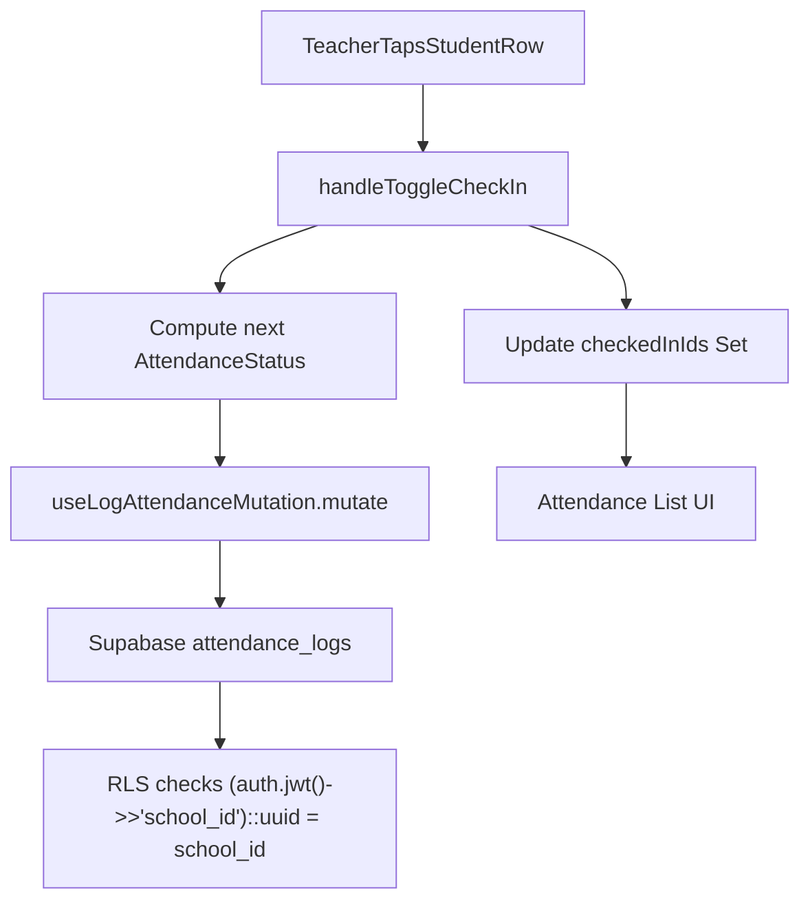

## Overview

- **Database**: Add an `attendance_logs` table via a new Supabase migration, scoped by `school_id` and protected by RLS using the existing `(auth.jwt() ->> 'school_id')::uuid` convention.
- **Frontend**: Introduce a typed TanStack Query `useMutation` for logging check-in events to `attendance_logs`, and wire it into the existing Attendance List UI without breaking the Forest-First UX (60px+ hit area) or Zero-Any Policy.

## Step 1 – Supabase migration for `attendance_logs`

- **1.1 Create migration file**
  - Add a new SQL migration under `[supabase/migrations](supabase/migrations)` named using the existing convention, e.g. `20260311090000_create_attendance_logs.sql`.
- **1.2 Define `attendance_logs` schema**
  - Create table `public.attendance_logs` with columns:
    - `id uuid primary key default gen_random_uuid()`
    - `student_id uuid not null references public.students(id) on delete cascade`
    - `school_id uuid not null references public.schools(id) on delete cascade`
    - `status text not null check (status in ('present','absent'))`
    - `check_in_time timestamptz not null default now()`
  - Optionally add an index on `(school_id, student_id, check_in_time desc)` for future query performance.
- **1.3 Enable RLS and add policies**
  - `alter table public.attendance_logs enable row level security;`
  - Add **INSERT** policy:
    - `for insert with check ((auth.jwt() ->> 'school_id')::uuid = school_id);`
  - Add **SELECT** policy:
    - `for select using ((auth.jwt() ->> 'school_id')::uuid = school_id);`
  - Follow naming conventions used in `[supabase/migrations/20260222000000_initial_schools_profiles_students.sql](supabase/migrations/20260222000000_initial_schools_profiles_students.sql)` (e.g. `attendance_logs_insert_by_school`, `attendance_logs_select_by_school`).

## Step 2 – Frontend API for attendance logs

- **2.1 Define types and schemas**
  - In `[features/attendance/api.ts](features/attendance/api.ts)` (or a sibling file), add:
    - A TypeScript union type `AttendanceStatus = "present" | "absent";`.
    - A Zod schema for rows returned from `attendance_logs` if reads are needed later (e.g. `attendanceLogSchema` and `attendanceLogArraySchema`), keeping with existing `studentsArraySchema` style and Zero-Any Policy.
- **2.2 Implement Supabase write function**
  - Add a function like `logAttendance`:
    - Signature: `async function logAttendance(params: { studentId: string; schoolId: string; status: AttendanceStatus }): Promise<void>`.
    - Implementation: `getSupabase().from("attendance_logs").insert({ student_id: studentId, school_id: schoolId, status });`.
    - Throw on Supabase error; no `any` types.

## Step 3 – TanStack Query mutation hook

- **3.1 Add a mutation hook in attendance API layer**
  - In `[features/attendance/api.ts](features/attendance/api.ts)`, add a `useLogAttendanceMutation` hook:
    - Accepts `schoolId: string | null` (from `useAuthContext`).
    - Uses `useMutation` from TanStack Query with a mutation function that:
      - Requires non-null `schoolId` and calls `logAttendance({ studentId, schoolId, status })`.
      - Takes a payload type like `{ studentId: string; status: AttendanceStatus }`.
    - Optionally, in `onSuccess`, invalidates or refetches a future `attendanceLogsQueryKey(schoolId)` if/when read-side is implemented; for now it may be a fire-and-forget log.
  - Ensure all generics are inferred or explicitly typed to avoid `any`, consistent with `useStudents`.

## Step 4 – Wire mutation into Attendance List UI

- **4.1 Inject auth context into the screen**
  - `TabsIndexScreen` in `[app/(tabs)/index.tsx](app/(tabs)/index.tsx)` already calls `useAuthContext()` and receives `schoolId`.
  - Instantiate `useLogAttendanceMutation(schoolId)` inside `TabsIndexScreen`.
- **4.2 Update the toggle handler to call the mutation**
  - Replace the current `handleToggleCheckIn` implementation:
    - Continue updating the local `checkedInIds` `Set<string>` as it does today (to keep immediate UI feedback).
    - **Additionally**, compute the new status per student (e.g. `nextStatus = currentlyCheckedIn ? 'absent' : 'present'`).
    - Call `logAttendanceMutation.mutate({ studentId: id, status: nextStatus });`.
  - Keep all types explicit (`id: string`, `status: AttendanceStatus`) in the handler and mutation payload.
- **4.3 Preserve Forest-First UX (toggle hit area)**
  - Leave the `StudentRow` layout’s `min-h-[60px]` container class as-is to maintain a row-height of at least 60px.
  - Optionally (without shrinking hit area), make the entire row pressable by:
    - Moving the `TouchableOpacity` wrapper to cover the full row or adding an additional transparent `TouchableOpacity` that spans the row, while keeping the visible button styling on the right.
  - Verify that no refactor of the touch target reduces the physical tap area below 60px in height on common devices.

## Step 5 – (Optional) Future enhancements

- **5.1 Read-side attendance views**
  - Later, introduce `fetchAttendanceLogs` + `useAttendanceLogs` using `attendanceLogArraySchema`, keyed by `schoolId` and optionally `date`.
  - Use this to pre-populate `checkedInIds` when the screen mounts, instead of starting from an empty `Set`.
- **5.2 Error and offline handling**
  - Add user feedback (e.g. banner or toast) when logging fails, and consider reconciling local optimistic state with server failures.

## Data-flow sketch

