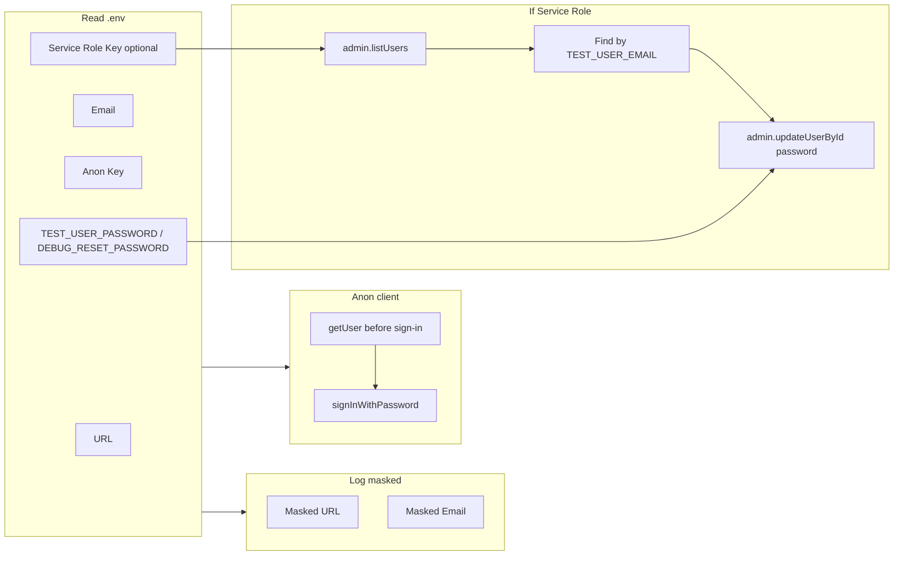

# Debug Auth Diagnostic Script

## Context

[lib/verify-rls.ts](lib/verify-rls.ts) fails with "Invalid login credentials" when calling `supabase.auth.signInWithPassword({ email, password })`. It uses `EXPO_PUBLIC_SUPABASE_URL`, `EXPO_PUBLIC_SUPABASE_ANON_KEY`, and `TEST_USER_EMAIL` / `TEST_USER_PASSWORD` from [.env](.env). There is no Service Role Key in the repo today; the script will use it only when available.

## Deliverable

A single temporary file: `**lib/debug-auth.ts**`, runnable with `npx tsx lib/debug-auth.ts` (or add a `"debug-auth": "tsx lib/debug-auth.ts"` script to [package.json](package.json)).

---

## 1. Setup and masked logging

- Use `import "dotenv/config"` (same as [lib/verify-rls.ts](lib/verify-rls.ts)) and read:
  - `EXPO_PUBLIC_SUPABASE_URL`
  - `EXPO_PUBLIC_SUPABASE_ANON_KEY`
  - `TEST_USER_EMAIL`, `TEST_USER_PASSWORD`
  - Optional: `SUPABASE_SERVICE_ROLE_KEY`
  - Optional: `DEBUG_RESET_PASSWORD` (password to set when doing the admin reset; if missing, use `TEST_USER_PASSWORD` so sign-in works after reset)
- **Mask and log**:
  - **Supabase URL**: e.g. `https://pwt***yo.supabase.co` (first 3 + last 2 chars of host subdomain, or similar safe mask).
  - **Email**: e.g. `t***n@test.local` (first char + `*` + last char before `@` + `@` + domain).

Sensitive values must not be printed in full.

---

## 2. Anon client and pre-sign-in session check

- Create Supabase client with URL + anon key (same as verify-rls).
- **Before** calling `signInWithPassword`, call `supabase.auth.getUser()` and log:
  - Whether a user is returned (e.g. "getUser() before sign-in: none" or "getUser() before sign-in: user id xxx--xxx" with masked id).
- Then attempt `signInWithPassword({ email, password })` and log success or the error message (no need to log full error object if it contains secrets).

---

## 3. Service Role: list users and verify test user exists

- **If** `SUPABASE_SERVICE_ROLE_KEY` is set:
  - Create a second client with `createClient(url, serviceRoleKey)` (admin client).
  - Call `supabaseAdmin.auth.admin.listUsers()` (with pagination if needed, e.g. `perPage: 1000`) to fetch users from the same project.
  - Search the list for a user whose `email` matches `TEST_USER_EMAIL` (case-sensitive match is fine).
  - Log whether the test user was found and, if found, a masked user id (e.g. first 8 + `...` + last 4 of `id`).
- **If** `SUPABASE_SERVICE_ROLE_KEY` is not set:
  - Log that Service Role Key is missing and skip admin steps (no crash).

This uses the Auth Admin API (same backend as sign-in), so it confirms the user exists in the database the script is talking to.

---

## 4. Optional: force-reset password via admin

- **If** Service Role Key is set **and** the test user was found **and** a password value is available (either `DEBUG_RESET_PASSWORD` or `TEST_USER_PASSWORD`):
  - Call `supabaseAdmin.auth.admin.updateUserById(userId, { password: chosenPassword })` with the chosen value.
  - Log success or failure (e.g. "Password reset: ok" or "Password reset failed: ").
- **If** user was found but no password var is set:
  - Log that neither DEBUG_RESET_PASSWORD nor TEST_USER_PASSWORD is set, so skip reset.

---

## 5. Implementation notes

- **Masking helpers**: Implement small helpers that take a string and return a short masked version (e.g. URL host: `pwt***yo`, email: `t***n@test.local`, user id: `a0000001...0001`). No full secrets in logs.
- **Run order**: (1) masked URL + email, (2) getUser before sign-in, (3) sign-in attempt, (4) if service role set → list users → log if test user exists → optionally updateUserById.
- **.env.example**: Add a comment and optional line for `SUPABASE_SERVICE_ROLE_KEY` and optionally `DEBUG_RESET_PASSWORD` so the user knows what to set for full diagnostics. Do not commit a real service role key anywhere.

---

## 6. Optional npm script

- In [package.json](package.json), add `"debug-auth": "tsx lib/debug-auth.ts"` so the user can run `npm run debug-auth` without typing the path.

---

## Summary flow

No changes to `verify-rls.ts` or to RLS/migrations; this is a standalone diagnostic script to be removed once the issue is resolved.
