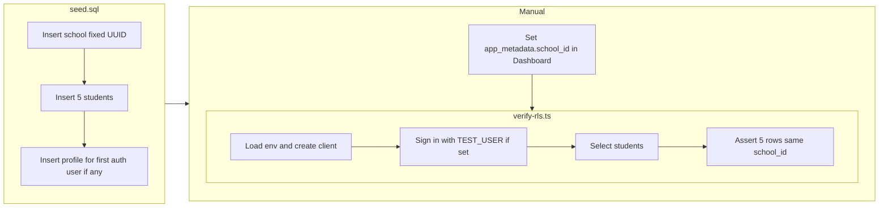

# Seed and RLS Verification Plan

## Context

- **Schema** (from [supabase/migrations/20260222000000_initial_schools_profiles_students.sql](supabase/migrations/20260222000000_initial_schools_profiles_students.sql)): `schools` (id, name), `profiles` (id → auth.users, school_id, email, full_name, role), `students` (id, school_id, first_name, last_name, date_of_birth). All RLS policies use `(auth.jwt() ->> 'school_id')::uuid = school_id`.
- **JWT**: Supabase includes `app_metadata` in the JWT. For RLS to allow access, the test user must have `app_metadata.school_id` set to the school UUID and the session refreshed (or use Dashboard: Authentication → Users → [user] → App Metadata → add `"school_id": "<school-uuid>"`).
- **Seed config**: [supabase/config.toml](supabase/config.toml) already has `sql_paths = ["./seed.sql"]` under `[db.seed]`, so the file must be [supabase/seed.sql](supabase/seed.sql).

---

## 1. Create `supabase/seed.sql`

**1.1 School (deterministic UUID)**  
Insert one row into `public.schools` with a fixed UUID so it can be referenced consistently in docs and verification:

- `id`: use a single deterministic UUID (e.g. `a0000001-0000-4000-8000-000000000001` or `gen_random_uuid()` stored via a CTE for reuse in the same script).
- `name`: `'Tulsa Area Forest School'`.

**1.2 Students (five rows)**  
Insert five rows into `public.students` with:

- `school_id`: the school id from step 1.1 (reference via CTE or the same fixed UUID if used for the school).
- `first_name`, `last_name`: varied sample names (e.g. "River", "Sage", "Brooks", "Willow", "Ash" / "Green", "Woods", etc.).
- `date_of_birth`: optional; can use a few sample dates for variety.

Use a single `INSERT ... SELECT` from a CTE that has the school id, or two statements (insert school returning id is awkward in a single file without a DO block; so either use a **fixed UUID for the school** and reference it in both student inserts and in docs, or use a CTE):

```sql
-- Option A: Fixed school UUID (simplest for docs and verify script)
INSERT INTO public.schools (id, name) VALUES
  ('a0000001-0000-4000-8000-000000000001'::uuid, 'Tulsa Area Forest School')
ON CONFLICT (id) DO NOTHING;

INSERT INTO public.students (school_id, first_name, last_name, date_of_birth) VALUES
  ('a0000001-0000-4000-8000-000000000001'::uuid, 'River', 'Green', '2018-03-15'),
  -- ... 4 more rows
ON CONFLICT DO NOTHING;  -- only if you add a unique constraint; else omit
```

(No unique constraint on students for (school_id, first_name, last_name), so avoid `ON CONFLICT` for students or make the seed idempotent by deleting/re-inserting or using a known set of names and a single run.)

**1.3 Test user profile**  
`profiles.id` references `auth.users(id)`, so you cannot insert a profile for a non-existent user.

- **Preferred approach**: Idempotent “ensure one profile for first auth user” so that after the first signup, re-running seed (or a one-off) creates the profile. In `seed.sql`, after inserting school and students, add an `INSERT INTO public.profiles (...)` that:
  - Selects the **first** auth user (e.g. `ORDER BY created_at LIMIT 1`) from `auth.users` that does **not** already have a row in `public.profiles`.
  - Sets `school_id` to the Tulsa school id, and `email` / `full_name` / `role` from `auth.users` or defaults.
  - Uses `ON CONFLICT (id) DO NOTHING` so re-runs are safe.
- **Documentation in seed**: Add a short comment at the top of the file explaining that for the test user to see students, they must have `app_metadata.school_id` set to the Tulsa school UUID (Dashboard or Admin API) and refresh the session.

**1.4 Idempotency**

- School: use a fixed UUID and `ON CONFLICT (id) DO UPDATE SET name = EXCLUDED.name` (or `DO NOTHING`) so reset + re-seed doesn’t duplicate.
- Students: no natural key; either accept duplicates on re-seed or use a single run. Simplest is to insert five rows without `ON CONFLICT` and document that seed is intended to run once after reset.
- Profile: `ON CONFLICT (id) DO NOTHING` as above.

---

## 2. Create `lib/verify-rls.ts`

**Purpose**: Run with the Supabase client to fetch students and confirm that, when the client has a session with `school_id` in the JWT, only that school’s students are returned (and count/contents are as expected).

**2.1 Environment**

- Use `EXPO_PUBLIC_SUPABASE_URL` and `EXPO_PUBLIC_SUPABASE_ANON_KEY` (same as [lib/supabase.ts](lib/supabase.ts)).
- For a **standalone script** that signs in as the test user, add optional `TEST_USER_EMAIL` and `TEST_USER_PASSWORD` to `.env.example` and document that the verify script uses them when set.
- Load env in the script (e.g. `dotenv` in Node, or assume Expo env is already set if run from the app). If the repo has no `dotenv`, add it as a dev dependency and load it at the top of `verify-rls.ts`, or use a small inline load only when running under Node.

**2.2 Flow**

1. Load env; create Supabase client (same as `getSupabase()` or `createClient(url, key)`).
2. If `TEST_USER_EMAIL` and `TEST_USER_PASSWORD` are set: call `supabase.auth.signInWithPassword({ email, password })` and then use the resulting session for subsequent requests (the client retains the session).
3. Fetch students: `supabase.from('students').select('id, school_id, first_name, last_name')`.
4. **Assert/expect**:

- If no session or JWT without `school_id`: expect 0 rows (or an error) — RLS blocks.
- If session has `school_id` = Tulsa school UUID: expect 5 rows, all with that `school_id`.

1. Log results (count, sample rows, and whether the check passed). Optionally log the current user and `session?.user?.app_metadata` for debugging.

**2.3 Running the script**

- Add a script in [package.json](package.json), e.g. `"verify-rls": "npx tsx lib/verify-rls.ts"` (or `ts-node` if preferred). Add `tsx` (or `ts-node`) as a dev dependency so the script runs under Node with env loaded.
- Document in the plan or README: after seeding, create a test user (or use existing), set `app_metadata.school_id` to the Tulsa school UUID, then run `npm run verify-rls` (with `TEST_USER_EMAIL` / `TEST_USER_PASSWORD` in `.env`).

---

## 3. `.env.example` and docs

- Add optional `TEST_USER_EMAIL` and `TEST_USER_PASSWORD` with a comment that they are used by the RLS verification script.
- In the seed file header (or a short README section), document:
  - The Tulsa school UUID used in the seed.
  - That the test user must have `app_metadata.school_id` set to that UUID (and session refreshed) to see the five students, per [.cursorrules](.cursorrules) and the migration RLS.

---

## 4. Summary flow



No changes to RLS policies or migrations are required; the verification script only confirms that the existing RLS behavior (see only my school’s students when `school_id` is in the JWT) holds after hydration.
