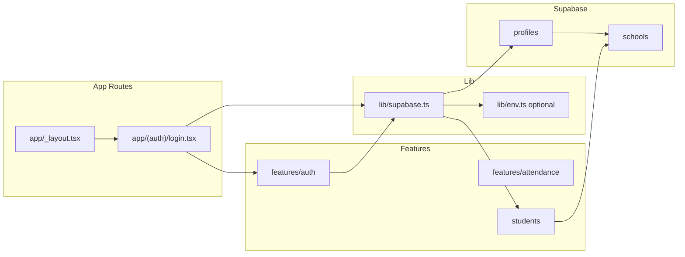

# TAFS Scaffold, Database, and Auth Plan

## Current state

- **Expo**: Project uses Expo SDK 54 with `expo-router` in dependencies and plugins, but **entry is still `index.ts` → `App.tsx`** (no `app/` directory yet).
- **Supabase**: Linked via `supabase/config.toml` (project_id: forest_schools). **No `supabase/migrations` folder** and no migrations yet.
- **Structure**: No `lib/`, `features/`, or `app/` routes exist. [.cursorrules](c:\Users\adam.kraft\Desktop\Projects\forest_schools.cursorrules) defines `app/` (Expo Router), `features/` (auth, attendance, students), `components/`, `lib/`, `theme/`.

---

## 1. Feature-based structure (scaffold)

Create directories and minimal surface so each feature is a clear module:

| Path                   | Purpose                                                   |
| ---------------------- | --------------------------------------------------------- |
| `features/auth/`       | Auth UI, hooks, and types (e.g. login form, session hook) |
| `features/attendance/` | Attendance domain (placeholders only for now)             |
| `features/students/`   | Students domain (placeholders only for now)               |

**Convention (per .cursorrules):** Logic and UI co-located by domain. Add an `index.ts` per feature that re-exports public API (e.g. screens, hooks, types) so the app imports from `features/auth`, etc. Optionally add a minimal placeholder file (e.g. `types.ts` or `index.ts`) so the folder is tracked and the structure is clear.

No need to create `components/` or `theme/` in this step unless you want empty placeholders.

---

## 2. Environment and lib setup

**2.1 `.env` (and `.env.example`)**

- Add `.env` with:
  - `EXPO_PUBLIC_SUPABASE_URL` — Supabase project URL
  - `EXPO_PUBLIC_SUPABASE_ANON_KEY` — Supabase anon/public key
- Add `.env.example` with the same keys and placeholder values (no secrets).
- Ensure `.env` is in `.gitignore` (and that `.env.example` is not ignored).

**2.2 `lib/supabase.ts` — singleton client**

- Use `createClient(EXPO_PUBLIC_SUPABASE_URL, EXPO_PUBLIC_SUPABASE_ANON_KEY)` from `@supabase/supabase-js`.
- Export a single instance (e.g. `supabase`) so the app and features use one client.
- Rely on Expo’s `expo-constants` or direct `process.env` for env vars (Expo typically inlines `EXPO_PUBLIC` at build time). No `any`; type the client appropriately.

**2.3 Optional**

- Add a small `lib/env.ts` that reads and validates `EXPO_PUBLIC_SUPABASE` (e.g. with Zod) and throws at startup if missing, so the rest of the app stays type-safe and fails fast.

---

## 3. Database schema (Supabase migration)

**3.1 Migration file**

- Create **one** migration under `supabase/migrations/`, e.g. `supabase/migrations/YYYYMMDDHHMMSS_initial_schools_profiles_students.sql` (timestamp-based name).

**3.2 Tables**

- `**schools`
  - `id` UUID PRIMARY KEY DEFAULT `gen_random_uuid()`
  - `name` TEXT NOT NULL (and any other columns you need, e.g. `created_at`, `updated_at`)
  - No `school_id` on this table (it is the tenant root).
- `**profiles`
  - `id` UUID PRIMARY KEY REFERENCES `auth.users(id)` ON DELETE CASCADE
  - `school_id` UUID NOT NULL REFERENCES `schools(id)` ON DELETE CASCADE
  - Optional: `email`, `full_name`, `role`, `created_at`, `updated_at`
  - Index: `CREATE INDEX idx_profiles_school_id ON profiles(school_id);`
- `**students`
  - `id` UUID PRIMARY KEY DEFAULT `gen_random_uuid()`
  - `school_id` UUID NOT NULL REFERENCES `schools(id)` ON DELETE CASCADE
  - Plus your desired columns (e.g. `first_name`, `last_name`, `date_of_birth`, `created_at`, `updated_at`)
  - Index: `CREATE INDEX idx_students_school_id ON students(school_id);`

**3.3 RLS**

- Enable RLS on `profiles` and `students` (and optionally on `schools` if you want RLS there too):

```sql
ALTER TABLE profiles ENABLE ROW LEVEL SECURITY;
ALTER TABLE students ENABLE ROW LEVEL SECURITY;
```

- Policies that enforce JWT `school_id` (per .cursorrules):
  - **profiles**: SELECT/UPDATE allowed when `(auth.jwt() ->> 'school_id')::uuid = school_id`. Optionally allow INSERT for the same condition (e.g. when creating a profile for the current user).
  - **students**: SELECT, INSERT, UPDATE, DELETE only when `(auth.jwt() ->> 'school_id')::uuid = school_id`.

Example (adapt table/action as needed):

```sql
CREATE POLICY "profiles_select_by_school"
  ON profiles FOR SELECT
  USING ((auth.jwt() ->> 'school_id')::uuid = school_id);
```

Repeat for UPDATE (and INSERT if desired) on `profiles`, and for SELECT/INSERT/UPDATE/DELETE on `students`. If you add RLS to `schools`, use the same predicate for SELECT (and optionally UPDATE) so users only see their school.

**3.4 JWT claim `school_id`**

- RLS relies on `auth.jwt() ->> 'school_id'`. Supabase does not set this by default. You will need either:
  - A **Custom Access Token Hook** that copies `app_metadata.school_id` into the JWT, or
  - Storing `school_id` in `profiles` and, after login, setting `app_metadata.school_id` (via Admin API or a trigger) and refreshing the session so the next token includes it.

Include in the migration (or a follow-up) a trigger that creates a row in `profiles` on `auth.users` insert, if you want profiles created at signup; the trigger can set a default `school_id` (e.g. from app_metadata) or leave it to the app.

---

## 4. Auth integration and login route

**4.1 Expo Router entry**

- Switch to file-based routing: set `package.json` `**"main": "expo-router/entry"` so the root layout is used.
- Add `**app/_layout.tsx`: root layout that wraps the app with any global providers (e.g. QueryClientProvider, Supabase AuthProvider if you use one). This replaces the current [App.tsx](c:\Users\adam.kraft\Desktop\Projects\forest_schools\App.tsx) as the effective root UI.

**4.2 Login route: `app/(auth)/login.tsx`**

- **Route group**: `(auth)` is a group (no segment in URL). So the path is `/login`, not `/(auth)/login`.
- **Screen content**: Simple login UI (e.g. email + password) that:
  - Calls `supabase.auth.signInWithPassword({ email, password })` using the singleton from `lib/supabase.ts`.
  - On success: ensure `school_id` is in the user’s JWT (via app_metadata + refresh or custom token hook), then redirect (e.g. `router.replace('/')` or to a home/dashboard route).
  - On error: show a message (no `any`; type the error or use Zod/typed error handling).
- **A11y**: Use `accessibilityLabel` and `accessibilityRole` on the form controls and button (per .cursorrules).
- **Types**: Explicit return types; validate form input with Zod if you want to align with “Zod-first” in .cursorrules.

**4.3 Optional**

- Auth state: Use `supabase.auth.onAuthStateChange` in the root layout or a provider to redirect unauthenticated users to `/login` and authenticated users away from `/login`.
- `features/auth`: Move login form and any shared auth types/hooks into `features/auth` and import them from `app/(auth)/login.tsx` so the route stays thin and the feature owns the logic.

---

## 5. Order of implementation (suggested)

1. **Scaffold**: Create `features/auth`, `features/attendance`, `features/students` with index (and optional placeholder files).
2. **Env + lib**: Add `.env`, `.env.example`, and `lib/supabase.ts` (and optionally `lib/env.ts`).
3. **Migration**: Add `supabase/migrations/<timestamp>_initial_schools_profiles_students.sql` with tables, indexes, and RLS policies; run `supabase db reset` or `supabase migration up` locally to verify.
4. **Expo Router + auth**: Set `main` to `expo-router/entry`, add `app/_layout.tsx`, then add `app/(auth)/login.tsx` that uses the Supabase client and (when ready) JWT `school_id` for tenant isolation.

---

## 6. Diagram (high-level)



---

## 7. Notes

- **school_id in JWT**: Until the Custom Access Token Hook (or app_metadata flow) is in place, `(auth.jwt() ->> 'school_id')::uuid` will be NULL and RLS will block access. Plan to set `app_metadata.school_id` when assigning a user to a school and to refresh the session (or implement the hook) before relying on RLS in production.
- **.cursorrules and .gitignore**: Your rules say to add .cursorrules and cursor-specific plans to .gitignore; ensure that’s done so this plan and rules stay out of the repo if desired.
