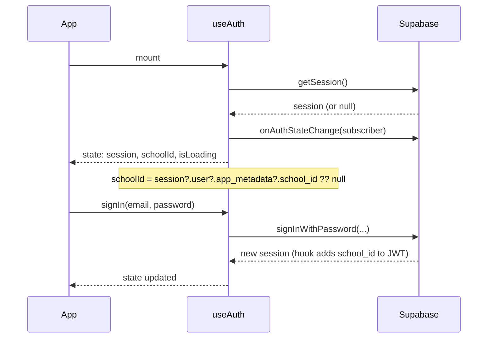

# useAuth Hook and Login Screen — Implementation Plan

## 1. Directory structure

| Path                                                 | Purpose                                                                                                            |
| ---------------------------------------------------- | ------------------------------------------------------------------------------------------------------------------ |
| [features/auth/useAuth.ts](features/auth/useAuth.ts) | Hook: session state, hydration, `school_id` from JWT, sign-in/out helpers. Explicit return type.                   |
| [features/auth/types.ts](features/auth/types.ts)     | Auth-related types: `AuthState`, `AppMetadataWithSchoolId`, and extended `User` type for `app_metadata.school_id`. |
| [features/auth/index.ts](features/auth/index.ts)     | Re-export `useAuth` and types (per .cursorrules feature co-location).                                              |
| [lib/supabase.ts](lib/supabase.ts)                   | No structural change; remain the single Supabase client source used by `useAuth`.                                  |
| [app/(auth)/login.tsx](<app/(auth)/login.tsx>)       | Login screen: high-contrast UI, 44×44px touch targets, dev prefill `tafs-admin@test.local`.                        |
| [app/(tabs)/layout.tsx](<app/(tabs)/_layout.tsx>)    | **New.** Protected layout: redirect to `/login` when not authenticated.                                            |
| [app/(tabs)/index.tsx](<app/(tabs)/index.tsx>)       | **New.** Tab root (current “home” content moved here).                                                             |
| [app/layout.tsx](app/_layout.tsx)                    | Wrap app with `QueryClientProvider` (TanStack Query) so `useAuth` and any query hooks work everywhere.             |

**Optional (recommended):** [lib/AuthProvider.tsx](lib/AuthProvider.tsx) — Context that calls `useAuth` and exposes `{ session, user, schoolId, isLoading, signIn, signOut }` so the gate (index + (tabs) layout) and login screen can consume one source of truth without prop drilling. If you prefer minimal setup, the hook alone can be used in each screen/layout.

**Note:** There is no existing `app/(tabs)/` today; the plan introduces it and moves the current “home” behavior into `app/(tabs)/index.tsx`.

---

## 2. How `useAuth` interfaces with the Supabase client

- **Single client:** `useAuth` (and the rest of the app) use only [lib/supabase.ts](lib/supabase.ts) via `getSupabase()`. No second client; RLS and auth state stay consistent.
- **Session source:** Call `getSupabase().auth.getSession()` once on mount to hydrate (avoid flash of wrong UI). Subscribe to `getSupabase().auth.onAuthStateChange()` and update local state so session stays in sync (sign-in, sign-out, token refresh).
- `**school_id`: Read from the current session’s JWT-backed user metadata. Supabase’s custom access token hook (see [auth_hook_and_jwt_logging plan](.cursor/plans/auth_hook_and_jwt_logging_1d679f1b.plan.md)) copies `school_id` from `raw_app_meta_data` into the JWT; Supabase then exposes it on `session.user.app_metadata`. So:
  - Type `app_metadata` as `{ school_id?: string }` (in [features/auth/types.ts](features/auth/types.ts)) and read `schoolId = session?.user?.app_metadata?.school_id ?? null`.
  - No client-side JWT decode required for normal app flow; optional decode only for debugging.
- **Return shape (explicit type):** e.g. `{ session: Session \| null; user: User \| null; schoolId: string \| null; isLoading: boolean; signIn: (email: string, password: string) => Promise<void>; signOut: () => Promise<void>; }`. All functions have explicit return types (`Promise<void>`, etc.); no `any`.
- **Persistence:** Supabase client persists the session in async storage by default. No extra persistence logic in the hook; the hook only reads and reacts to `getSession()` and `onAuthStateChange`.



---

## 3. Layout strategy for protecting routes in `app/(tabs)/`

- **Auth gate at entry:** Keep [app/index.tsx](app/index.tsx) as the initial route. It uses `useAuth()` (or AuthContext). While `isLoading === true`, render a minimal loading UI (e.g. blank or splash). When `isLoading === false`:
  - If no session → `<Redirect href="/login" />`.
  - If session → `<Redirect href="/(tabs)" />` (or the actual path of the tabs root, e.g. `/(tabs)` in Expo Router).
- **Protected (tabs) layout:** Add [app/(tabs)/layout.tsx](<app/(tabs)/_layout.tsx>). Inside the layout, call `useAuth()`. If `!session` and `!isLoading`, render `<Redirect href="/login" />` so that any direct deep link to a tab route sends unauthenticated users to login. If authenticated, render the tab layout (e.g. `<Tabs>` or `<Stack>`) and `<Slot />` for child screens.
- **Login screen:** [app/(auth)/login.tsx](<app/(auth)/login.tsx>) does not redirect authenticated users by default in this plan; the app entry point and (tabs) layout handle “already logged in” by redirecting to `/(tabs)`. Optionally, login can redirect to `/(tabs)` when `session` is already set (e.g. after hydration) to avoid showing the form briefly.
- **Single source of truth:** Both `app/index.tsx` and `app/(tabs)/_layout.tsx` use the same auth state (from `useAuth` or from AuthContext). No duplicate `getSession()` logic in layouts; the hook (and optional provider) centralize it.

```mermaid
flowchart LR
  subgraph entry [Entry]
    Index["app/index.tsx"]
  end
  subgraph auth [Auth Routes]
    Login["app/(auth)/login.tsx"]
  end
  subgraph protected [Protected]
    TabsLayout["app/(tabs)/_layout.tsx"]
    TabsIndex["app/(tabs)/index.tsx"]
  end

  Index -->|"isLoading"| Loading["Loading UI"]
  Index -->|"!session"| Login
  Index -->|"session"| TabsLayout
  TabsLayout -->|"!session" redirect"| Login
  TabsLayout -->|"session"| TabsIndex
  Login -->|"signIn success"| TabsLayout
```

---

## 4. Login screen requirements (Forest School + dev prefill)

- **.cursorrules compliance:** High-contrast (e.g. dark text on light background or vice versa with sufficient contrast ratio). All interactive elements meet **44×44px minimum** touch targets; use `minHeight: 44`, `minWidth: 44`, and `padding` so hit area is at least 44×44. Keep existing `accessibilityLabel` and `accessibilityRole` on inputs and button.
- **Dev prefill:** If `__DEV__` (or a small `lib/env` check) is true, pre-populate the email field with `tafs-admin@test.local`. Do not prefill password.
- **Tech:** Use existing stack: Expo Router, Supabase via `getSupabase()`, and either StyleSheet or NativeWind if the project has it configured (currently no `tailwind.config` was found; StyleSheet is fine and keeps the plan agnostic). TanStack Query is not required on the login screen itself; it’s used elsewhere for data fetching.
- **Strict TypeScript:** All handlers and components have explicit return types; no `any`. Use typed `signIn` from `useAuth` (e.g. `signIn(email, password)` returning `Promise<void>`).

---

## 5. Implementation order (high level)

1. **Types** — Add [features/auth/types.ts](features/auth/types.ts) with `AppMetadataWithSchoolId`, auth state type, and any extended User type needed for `app_metadata.school_id`.
2. **useAuth hook** — Add [features/auth/useAuth.ts](features/auth/useAuth.ts): `getSession()` on mount, `onAuthStateChange` subscription, derive `schoolId` from `session?.user?.app_metadata?.school_id`, expose `session`, `user`, `schoolId`, `isLoading`, `signIn`, `signOut` with explicit return types. Use `getSupabase()` only.
3. **Feature barrel** — Add [features/auth/index.ts](features/auth/index.ts) re-exporting the hook and types.
4. **Optional AuthProvider** — If desired, add [lib/AuthProvider.tsx](lib/AuthProvider.tsx) that uses `useAuth` and provides the same values via context; wrap root layout with it.
5. **Root layout** — Ensure [app/layout.tsx](app/_layout.tsx) wraps the app with TanStack `QueryClientProvider` (and `AuthProvider` if used).
6. **Entry gate** — Update [app/index.tsx](app/index.tsx) to use `useAuth`, show loading while `isLoading`, then redirect to `/login` or `/(tabs)` based on session.
7. **Protected (tabs)** — Add [app/(tabs)/layout.tsx](<app/(tabs)/_layout.tsx>) that redirects to `/login` when unauthenticated; otherwise render tabs/stack and `<Slot />`. Add [app/(tabs)/index.tsx](<app/(tabs)/index.tsx>) with current home content (e.g. TAFS title + sign out). Remove or redirect [app/home.tsx](app/home.tsx) to `/(tabs)` to avoid two “home” routes.
8. **Login screen** — Rewrite [app/(auth)/login.tsx](<app/(auth)/login.tsx>): high-contrast UI, 44×44px targets, dev prefill `tafs-admin@test.local`, call `useAuth().signIn`, explicit return types, and optional redirect to `/(tabs)` when already authenticated after hydration.

---

## 6. Summary

- **Hook location:** `features/auth/useAuth.ts`; Supabase used only via `getSupabase()`; `school_id` from `session.user.app_metadata.school_id`; full session lifecycle and explicit return types.
- **Route protection:** `app/index.tsx` and `app/(tabs)/_layout.tsx` both use the same auth state and redirect unauthenticated users to `/login`; authenticated users land in `app/(tabs)/`.
- **Login UI:** Forest School standards (high-contrast, 44×44px), dev prefill, strict TypeScript.

No code will be generated until you approve this plan.
