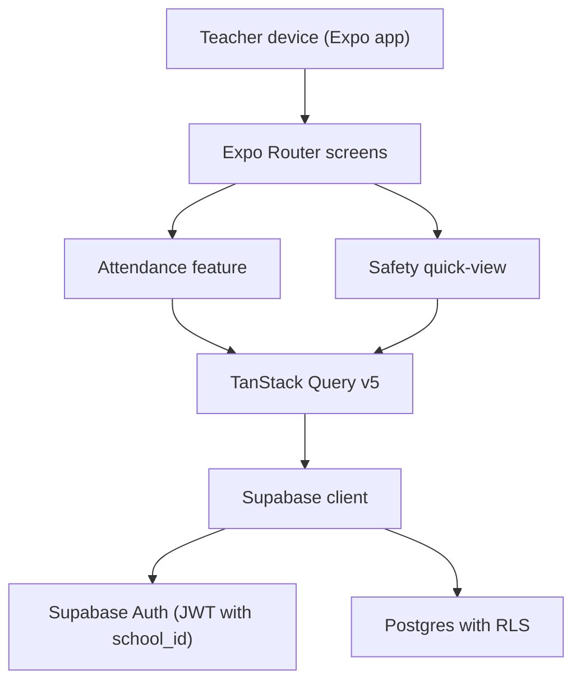

## Tulsa Area Forest School (TAFS) — A Multi-Tenant Mobile Ecosystem for Rugged Environments

Tulsa Area Forest School (TAFS) is a field-ready, multi-tenant mobile app designed for educators working outdoors.  
It combines **Forest-First UX** with **strictly-enforced multi-tenant security** (Supabase + RLS) so multiple schools can safely share one platform without leaking data between tenants.

---

## Technical Philosophy

- **Forest-First UX**
  - **Touch targets are ≥ 60px** and layouts are tuned for gloved hands, quick taps, and low-attention usage in outdoor environments.
  - **Slate-on-white high contrast** typography and surfaces prioritize legibility in partial sun and glare.
  - **Low cognitive load**: critical actions (attendance, emergency contacts) are one or two taps away, with minimal navigation depth.

- **Zero-Any Policy**
  - **Strict TypeScript**: app and feature code avoid `any`, favoring explicit domain types.
  - **Typed Supabase integration**: database interactions flow through typed helpers (for example `features/attendance/api.ts`) and schema-aligned models.
  - **Fail-fast env validation**: `lib/env.ts` uses Zod to validate required environment variables at startup and crash early when misconfigured.

---

## Architecture

- **Expo SDK 54 + React Native**
  - Cross-platform mobile runtime with `expo-router` as the navigation and routing layer.
  - Uses `NODE_OPTIONS=--experimental-vm-modules` to stay friendly to Node 22 on Windows.

- **NativeWind v4**
  - Tailwind-style utility classes applied directly to native components.
  - Forest-First tokens emphasize high-contrast palettes and minimum 44–60px hit areas.

- **TanStack Query v5**
  - Orchestrates reads and writes to Supabase with query/mutation hooks.
  - Attendance logging is wired through mutations for atomic, cache-aware updates.

- **Supabase with custom JWT-based RLS**
  - Postgres + Auth backed by RLS where **every row is scoped by `school_id`**.
  - A **custom access token hook** injects `school_id` into the JWT so RLS can rely on `auth.jwt() ->> 'school_id'`.
  - Multi-tenant separation is enforced at the database layer; the app never sees cross-school data.

### High-level flow



---

## Feature Showcase

- **Attendance Persistence**
  - Attendance toggles are backed by an `attendance_logs` table in Supabase, with writes funneled through a typed API layer (`features/attendance/api.ts`) and TanStack Query mutations.
  - Each toggle is logged atomically with the current `school_id`, ensuring teachers can safely track check-ins even in intermittent connectivity.
  - RLS enforces that each authenticated user only reads and writes rows for their own `school_id`.

- **Safety Quick-View**
  - The `StudentEmergencyCard` component surfaces **high-visibility emergency cards** with:
    - Student name and primary/secondary guardians.
    - Phone numbers with one-tap dial actions.
    - Prominent medical alerts / allergy information.
  - The layout uses large type, high contrast, and ≥ 60px call-to-action buttons so staff can operate it quickly in stressful, outdoor scenarios.

---

## Local Development

- **.env.example is the source of truth**
  - The file `.env.example` is the **single source of truth** for all environment variables required to boot the system locally.
  - To get started:
    1. Copy `.env.example` to `.env`.
    2. Fill in the placeholders with your own Supabase project values (anon key, URL) and optional test credentials.
  - The real `.env` file is **never committed** (it is ignored via `.gitignore`); contributors and reviewers can fully understand and reproduce the setup using `.env.example` alone.

- **Supabase via Docker (Supabase CLI)**
  - Supabase is run locally through the **Supabase CLI**, which orchestrates Docker containers for Postgres, Auth, and associated services.
  - Key configuration lives under `supabase/`, including `supabase/config.toml` and SQL migrations for schema and RLS policies.
  - Typical workflow:
    - `supabase start` — boot the Supabase stack in Docker.
    - `supabase stop` — shut it down.
    - `supabase migration up` / `supabase db reset` — apply or reset schema to match the repo.

- **App startup (Windows / Node 22–friendly)**
  - Scripts are defined in `package.json` and are optimized for Node 22 on Windows:

    ```bash
    # Default entry point
    npm run start

    # Platform-specific shortcuts
    npm run android
    npm run ios
    npm run web

    # Fallback loader if you still see ESM URL issues
    npm run start:loader
    ```

  - These scripts set `NODE_OPTIONS=--experimental-vm-modules` and use `npx expo start` (or an explicit `node --loader tsx` for the loader) to avoid `ERR_UNSUPPORTED_ESM_URL_SCHEME` errors on Windows when absolute `C:\` paths are involved.

- **Environment variables (overview)**
  - See `.env.example` for the authoritative list. Examples include:
    - `EXPO_PUBLIC_SUPABASE_URL` — your Supabase project URL (or local URL when using Docker).
    - `EXPO_PUBLIC_SUPABASE_ANON_KEY` — the public anon key.
    - `TEST_USER_EMAIL` / `TEST_USER_PASSWORD` — optional test credentials used by RLS verification scripts.
    - `SUPABASE_SERVICE_ROLE_KEY` / `DEBUG_RESET_PASSWORD` — optional keys for diagnostic scripts only (never required to run the app).
  - `lib/env.ts` validates required values at runtime and surfaces actionable error messages if they are missing.

---

## Security & Multi-Tenant Guarantees

- **JWT with `school_id`**
  - A Supabase **Custom Access Token Hook** ensures that each user's token contains a `school_id` claim derived from their app metadata.
  - RLS policies rely on this claim so that queries are automatically scoped at the database layer.

- **Row-Level Security per school**
  - Tables such as `students` and `attendance_logs` use RLS policies checking that:
    - `auth.jwt() ->> 'school_id'` matches the row's `school_id`.
  - This provides hard isolation between schools even if clients misbehave.

- **Diagnostic scripts as proof of verification**
  - `lib/verify-rls.ts` signs in as a test user, decodes the JWT, and asserts that the students query only returns rows for the expected `school_id`.
  - `lib/debug-auth.ts` assists with debugging auth failures and password resets during local setup.
  - These scripts are **dev-only utilities** and are guarded so that their logging does not pollute production builds.

---

## Development Commands (summary)

- **Start the app (default)**:

  ```bash
  npm run start
  ```

- **Platform-specific shortcuts**:

  ```bash
  npm run android
  npm run ios
  npm run web
  ```

- **Fallback loader script (if you still hit ESM errors)**:

  ```bash
  npm run start:loader
  ```

These commands use `cross-env` to set `NODE_OPTIONS=--experimental-vm-modules` and run Expo in a way that is reliable across Windows, macOS, and Linux.
